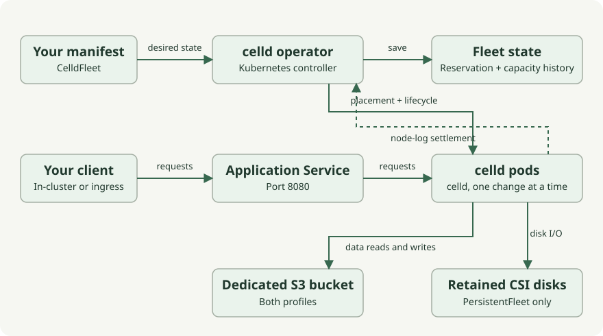

A CelldFleet describes one independent celld cluster. The operator creates its
Kubernetes resources and applies lifecycle requests to them. Each fleet has a
dedicated bucket and a permanent storage reservation bound to its UID.

| Component | Responsibility |
| --- | --- |
| celld | Application execution, replication, tiering and recovery. It tolerates the loss of any one member and reports ready only after a restarted member has recovered. |
| Operator | Rendering and applying workloads and their prerequisites, placement, capacity observation, one-member-per-step scale-in, replacing a member that cannot come back on its own, and for PersistentFleet, disk deletion when the fleet is deleted. |
| Kubernetes and CSI | Scheduling, rolling updates, resource versions, storage protection, attachment and volume deletion. |

Both profiles run celld directly; there is no launcher. Bucket uses a
Deployment or Ordered StatefulSet with temporary disk and
`CELLD_DURABILITY=bucket`. PersistentFleet uses a StatefulSet with retained CSI
disks and `CELLD_DURABILITY=fleet`. All runtime/recovery members need the
compatible fork.

The operator creates application and headless Services, NetworkPolicies, a
PodDisruptionBudget and storage reservations. It has no S3 client or EC2
termination path. You supply buckets, runtime IAM roles, nodes, CSI, ingress,
TLS and DNS. PersistentFleet advertises stable per-Pod DNS through its headless
Service, including before readiness, so celld can reach retained follower logs
after Pod IPs change.

Capacity recommendations and manual requests take the same path: growth in one
step, and scale-in one member per step after the previous change has rolled
out. Restarts and upgrades are the workload controller's rolling update; the
operator deletes a Pod only to heal a member. See the
[PersistentFleet lifecycle](../current-operation/).
The reservation keeps only capacity-policy history; status is reconstructed and
clearing it authorizes nothing.

Read the [lifecycle contract](../../contracts/current-operation/) and
[runtime control plane](../../contracts/runtime-control-plane/) for details.
